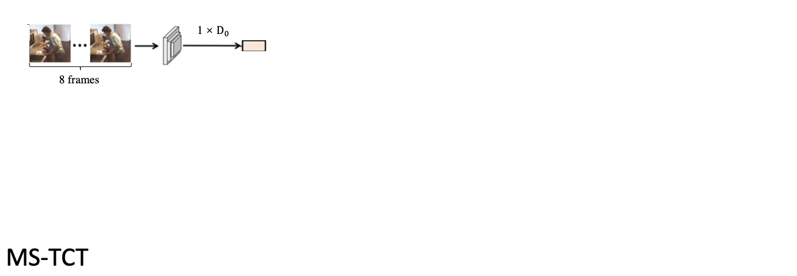

# Human-object interaction (HOI) problem domain Activity Detection 🏃‍♀️🏃‍♂️

This project aims to detect activities in a video using a TSU and STEP dataset! As a user, you will be using the [jupyter notebook](activity-detection.ipynb), which will allow you to run the code and see the results. but before that please set up the environment!

**Do note that more documentation will be in the [jupyter notebook](activity-detection.ipynb)!**

# Set Up 💾

## Clone the repository with Submodules

```bash
git clone --recurse-submodules https://github.com/ict3104-team14-2022/nvda-ml-activity-detection.git
```

## Setup environment

```bash
conda env create --file environment.yml
conda activate activity-detection
jupyter labextension install @jupyter-widgets/jupyterlab-manager
python -m ipykernel install --user --name ipykernel-activity-detection --display-name "Python (Activity Detection)"
jupyter-lab
```

## Install Dependencies

[ffmpeg](https://www.youtube.com/watch?v=qjtmgCb8NcE&ab_channel=LinuxLeech)

## Reinstall

```bash
jupyter kernelspec uninstall activity-detection
```

## Exporting Conda Dependencies

```bash
conda env export --from-history > environment.yml
```

## WanDB 1️⃣

You can connect the notebook the WanDB to view statistics online! Below is a reference on how to connect, but you can also refer to the [jupyter notebook](activity-detection.ipynb) under _Training Section_ to run it!

```python
# Link your wandb.
wandb.login()
# Display your project workspace.
%wandb ict3104-team14-2022/nvda-ml-activity-detection -h 2048
```

# Before You Begin - Here's what you need to know 📝

## TSU 🍎 - [Toyota Smart Home](https://project.inria.fr/toyotasmarthome)

Please request for the untrimmed dataset available in the [Toyota Smart Home](https://project.inria.fr/toyotasmarthome) site.

1. RGB - Videos in MP4 is required for feature extraction.
   - Place it in `data/TSU/TSU_Videos_mp4/`

## STEP 🍏 - [Spatio-Temporal Progressive Learning for Video Action Detection](https://github.com/NVlabs/STEP)

This algorithm is more involved, requires more effort to personally acquire the dataset as it is uploaded in YouTube.

1. Follow the [STEP README](https://github.com/NVlabs/STEP#installation) for installation instructions.
   - Install APEX.
   - Do not clone STEP as it is included in this repository.
   - In a terminal, cd into STEP, and install external packages with `python setup.py build develop`
2. Install ffmpeg - [Tutorial to add ffmpeg to path in Windows](https://www.youtube.com/watch?v=qjtmgCb8NcE&ab_channel=LinuxLeech)
3. Download the dataset from YouTube. In the `step/custom_utils` directory, there are scripts to download the videos.
   1. Install yt-dlp :
      ```bash
      pip install yt-dlp
      ```
   2. To get the list of valid videos, Run:
      ```
      python get_valid_youtube.py
      ```
   3. Download the videos, Run:
      ```
      python download_vids.py
      ```
   4. There may be some copyright issues when downloading videos.
      - In `get_valid_youtube.py` , comment and uncomment a specified block of code to remove videos that are not available from the train/val annotations.
      - Generate a new ava_train_v2.1_filter.csv and ava_val_v2.1_filter.csv, run:
        ```
        python get_valid_youtube.py
        ```
   5. Move videos into `step/datasets/ava/videos`
   6. Generate labels using [Dataset Preparation](https://github.com/NVlabs/STEP#dataset-preparation)
      ```
      python scripts/generate_label.py datasets/ava_val_v2.1_filter.csv
      python scripts/generate_label.py datasets/ava_train_v2.1_filter.csv
      ```
      - Move generated labels `val.pkl` and `train.pkl` into `datasets/ava/label`

After preparing the dataset and selecting a pipeline, In JupyterLab, **Kernel > Run Selected Cell and All Below.**

And you are done preparing STEP dataset! 🥳

## [CVPR 2022] MS-TCT  - [Multi-Scale Temporal ConvTransformer for Action Detection](https://github.com/dairui01/MS-TCT)


[Here for paper](https://openaccess.thecvf.com/content/CVPR2022/papers/Dai_MS-TCT_Multi-Scale_Temporal_ConvTransformer_for_Action_Detection_CVPR_2022_paper.pdf)

1.  **Prepare the I3D feature** Like the previous works (e.g. TGM, PDAN), MS-TCT is built on top of the pre-trained I3D features. Thus, feature extraction is needed before training the network.

    1.  Please download the Charades dataset (24 fps version) from this [link](https://prior.allenai.org/projects/charades).
    2.  Follow this [repository](https://github.com/piergiaj/pytorch-i3d) to extract the snippet-level I3D feature.

2.  **Dependencies** Please satisfy the following dependencies to train MS-TCT correctly:

- pytorch 1.9
- python 3.8
- timm 0.4.12
- pickle5
- scikit-learn
- numpy

3.  **Quick Start**

    1. Change the _rgb_root_ to the extracted feature path in the _train.py_.
    2. Use `./run_MSTCT_Charades.sh` for training on Charades-RGB. The best logits will be saved automatically in _./save_logit_.
    3. Use `python Evaluation.py -pkl_path /best_logit_path/` to evaluate the model with the per-frame mAP and the action-conditional metrics.

If you need more reference please go to this [readme](./MS-TCT/README.md).

And you are done preparing MS-TCT dataset! 🥳

# Pipeline Selection 👷

There are three algorithms available in this notebook.

1. [Toyota Smart Home](https://project.inria.fr/toyotasmarthome). Toyota Smarthome Untrimmed (TSU) is targeting the activity detection task in long untrimmed videos. Therefore, in TSU, the entire recording when the person is visible. The dataset contains 536 videos with an average duration of 21 mins. The dataset is annotated with 51 activities.

2. [Spatio-Temporal Progressive Learning for Video Action Detection](https://github.com/NVlabs/STEP) STEP a progressive learning framework for spatio-temporal action detection in videos. To learn more, the poster can be found at [Google Drive](https://drive.google.com/file/d/1GWWLH5HQM8FoEIutIOzvtURBI6y09NBr/view). For a more in-depth discussion, the paper can be read at [arxiv](https://arxiv.org/abs/1904.09288). It uses the [AVA Actions v2.1 dataset](https://research.google.com/ava/download.html). The dataset is annotated with 80 activities.

3. [Multi-Scale Temporal ConvTransformer for Action Detection](https://github.com/dairui01/MS-TCT) Action detection is a significant and challenging task, especially in densely-labelled datasets of untrimmed videos. Such data consist of complex temporal relations including composite or co-occurring actions. To detect actions in these complex settings, it is critical to capture both shortterm and long-term temporal information efficiently. To this end, we propose a novel ‘ConvTransformer’ network for action detection: MS-TCT.
